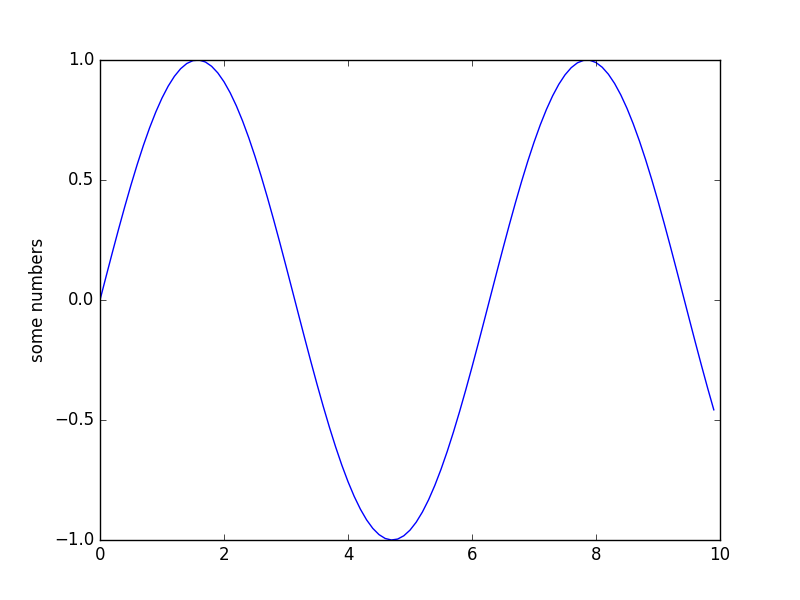
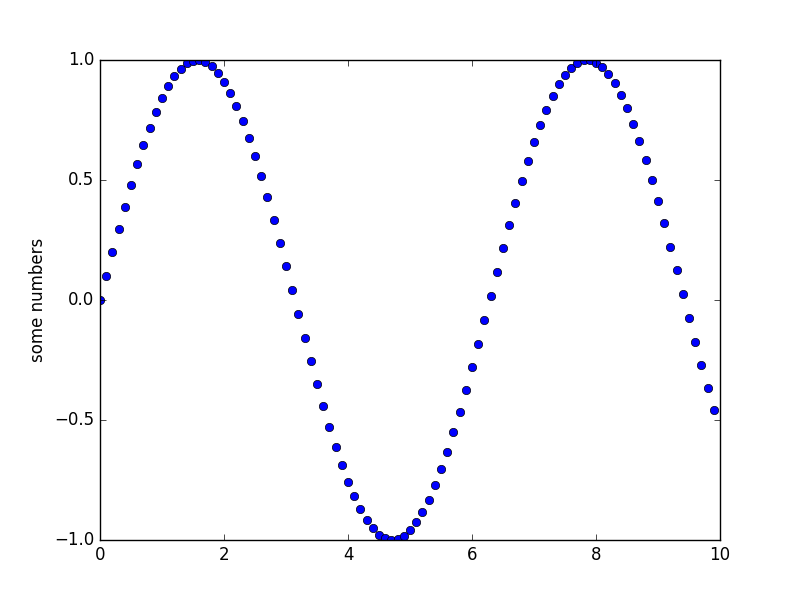
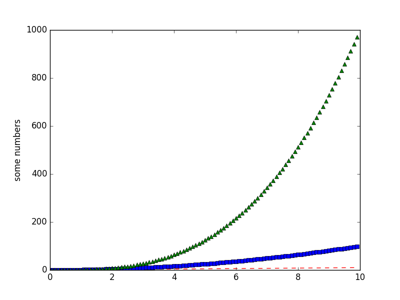
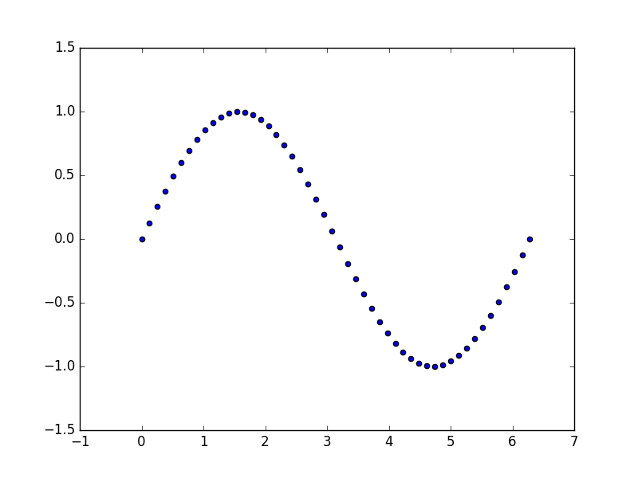
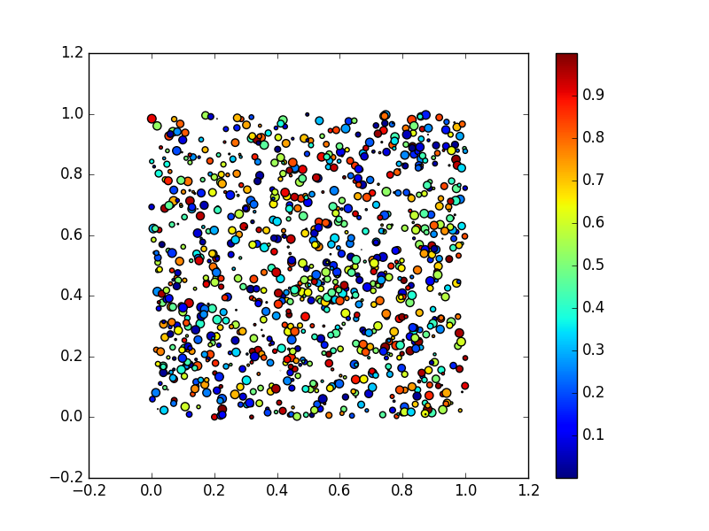
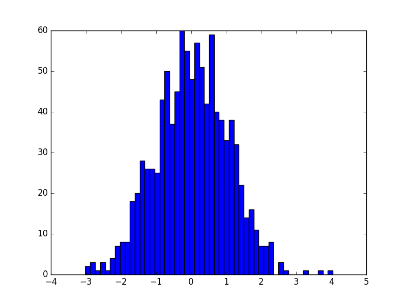
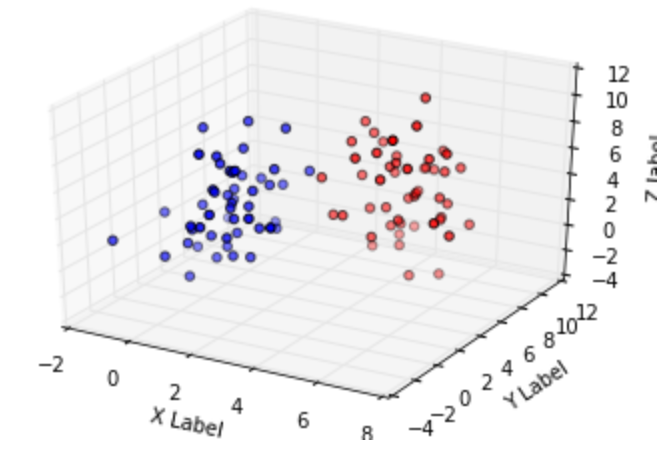

## 基本操作

```
import numpy as np
import matplotlib.pyplot as plt

x = np.arange(0, 10, 0.1)
y = np.sin(x)

plt.plot(x, y)
plt.ylabel('some numbers')
plt.show()
```




可以通过第三个参数改变样式：

```
plt.plot(x, y, 'bo') # plot x and y using blue circle markers
```



下表是可选样式:

|character|description|
|:-------:|:---------:|
|'-'|solid line|
|'--'|dashed line|
|'-.'|dash-dot line|
|':'|dotted line|
|'.'|point marker|
|','|pixel marker|
|'o'|circle marker|
|'v'|triangle_down marker|
|'^'|triangle_up marker|
|'<'|triangle_left marker|
|'>'|triangle_right marker|
|'1'|tri_down marker|
|'2'|tri_up marker|
|'3'|tri_left marker|
|'4'|tri_right marker|
|'s'|square marker|
|'p'|pentagon marker|
|'*'|star marker|
|'h'|hexagon1 marker|
|'H'|hexagon2 marker|
|'+'|plus marker|
|'x'|x marker|
|'D'|diamond marker|
|'d'|thin_diamond marker|
|'|'|vline marker|
|'_'|hline markebr|

下面是可选颜色

|character|color|
|:-------:|:---:|
|'b'|blue|
|'g'|green|
|'r'|red|
|'c'|cyan|
|'m'|magenta|
|'y'|yellow|
|'k'|black|
|'w'|white|


可以在一张图上绘制多条线:
```
# red dashes, blue squares and green triangles
plt.plot(x, x, 'r--', x, x**2, 'bs', x, x**3, 'g^')
plt.show()
```



## 创建多个图形

```
import matplotlib.pyplot as plt
plt.figure(1)                # 第一个图形
plt.subplot(211)             # 第一个图形的第一个子图
plt.plot([1, 2, 3])
plt.subplot(212)             # 第一个图形的第二个子图
plt.plot([4, 5, 6])


plt.figure(2)                # 第二个图形
plt.plot([4, 5, 6])          # 默认创建 subplot(111)

plt.figure(1)                # 当前是图形 1，subplot(212)
plt.subplot(211)             # 将第一个图形的 subplot(211) 设为当前子图
plt.title('Easy as 1, 2, 3') # 子图 211 的标题
```

## 散点图

```
# 简单的散点图
x = np.linspace(0, 2 * np.pi, 50)
y = np.sin(x)
plt.scatter(x,y)
plt.show()
```




## 彩色映射散点图

```
# 彩色映射散点图
x = np.random.rand(1000)
y = np.random.rand(1000)
size = np.random.rand(1000) * 50
color = np.random.rand(1000)
plt.scatter(x, y, size, color)
plt.colorbar()
plt.show()
```

图上点的大小和颜色根据数据的大小产生了变化



## 直方图

```
# 直方图
x = np.random.randn(1000)
plt.hist(x, 50)
plt.show()
```

``hist()``的第二个参数代表数据容器的个数，即将数据分成多少个直方



## 3D画图

导入包
```
import matplotlib.pyplot as plt  
from mpl_toolkits.mplot3d import Axes3D  
```

### 散点图
```
ax = plt.figure().add_subplot(111, projection = '3d')  
#基于ax变量绘制三维图  
#xs表示x方向的变量  
#ys表示y方向的变量  
#zs表示z方向的变量，这三个方向上的变量都可以用list的形式表示  
#m表示点的形式，o是圆形的点，^是三角形（marker)  
#c表示颜色（color for short）  
ax.scatter(xs, ys, zs, c = 'r', marker = '^') #点为红色三角形  
  
#设置坐标轴  
ax.set_xlabel('X Label')  
ax.set_ylabel('Y Label')  
ax.set_zlabel('Z Label')  
  
#显示图像  
plt.show()  
```



